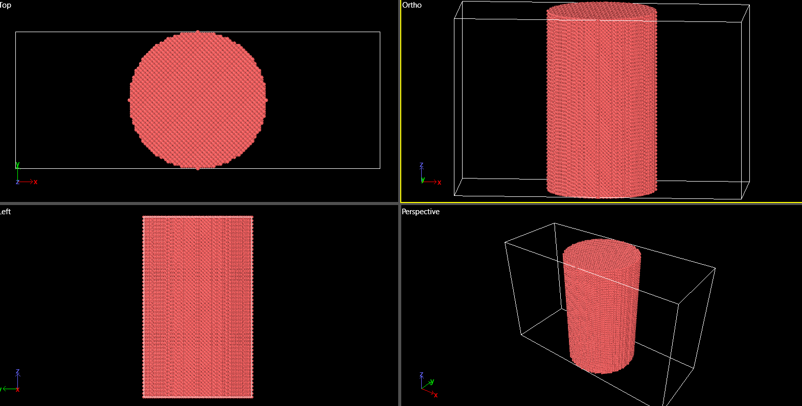

# lammps-Al-nanowire-stability-study
A molecular dynamics project using LAMMPS to model an aluminum nanowire, documenting the process and challenges of achieving a stable simulation.
# Molecular Dynamics Study: Creating a Stable Aluminum Nanowire

This repository documents the process of creating a stable, single-crystal aluminum (Al) nanowire using the LAMMPS molecular dynamics package. This project serves as a foundational step for future investigations into the mechanical properties of materials at the nanoscale.

More importantly, this repository is an honest account of the scientific and computational challenges involved in setting up a stable simulation of a surface-dominated system.

### Final Success: A Stable, Equilibrated Nanowire

The primary success of this project was the development of a robust LAMMPS script (`scripts/in.create_nanowire.lmp`) that reliably produces a structurally sound and thermally equilibrated Al nanowire at 300K.

*Visualization of the final, equilibrated nanowire using OVITO. The structure is stable, and atoms are vibrating around their lattice positions at 300K.*

---

### The Research Journey: Overcoming Simulation Instabilities

The path to a stable simulation was not linear. The project's full completion (a tensile test) was halted by a series of classic molecular dynamics challenges. Documenting these "failures" is critical, as they provided more learning opportunities than an immediate success.

#### Challenge 1: The `Lost atoms` Error
*   **Observation:** Initial attempts to heat or deform the nanowire often resulted in a `Lost atoms` error, where atoms were ejected from the simulation box with unphysically high velocity.
*   **Investigation:** The root cause was traced to two primary sources:
    1.  **Initial Geometry:** Creating atoms on a lattice inside a perfect cylinder can place surface atoms in unstable, low-coordination sites.
    2.  **Thermal Shock:** Instantaneously setting a 0K structure to a 300K target temperature can give these weakly-bound surface atoms enough energy to escape.
*   **Partial Solution:** A "Ramp-then-Hold" heating protocol was developed to warm the system gently, which improved stability but did not fully solve the problem under all conditions.

#### Challenge 2: Boundary Condition vs. Deformation Method Conflict
*   **Observation:** The tensile test phase consistently failed with a `Cannot use fix deform on a shrink-wrapped boundary` error.
*   **Investigation:** The `boundary s s p` command, which is excellent for creating a wire in a vacuum, is fundamentally incompatible with the `fix deform` command. `fix deform` requires active control of the box boundaries, while `s` implies passive control.
*   **Outcome:** This conflict proved to be the major roadblock to completing the tensile test phase. Future work would require implementing an entirely different loading strategy, such as the "Rigid Grips" method, which is compatible with the `f f p` boundaries needed for a true, isolated nanowire.

#### Challenge 3: Potential File Suitability
*   **Observation:** Different interatomic potential files for Aluminum showed vastly different levels of stability for this nanowire geometry.
*   **Investigation:** The initial potential (`Al99.eam.alloy`) seemed to produce higher forces on the highly-curved surface atoms compared to more robust, general-purpose potentials like `Al_zhou.eam.alloy`.
*   **Conclusion:** The choice of potential is not just about accuracy for bulk properties but also about numerical stability for surface-dominated systems.

### Repository Contents

*   `/scripts/`: Contains the final working LAMMPS input script `in.create_nanowire.lmp`.
*   `/potentials/`: Contains the EAM potential file (`Al99.eam.alloy`) used in the successful script.
*   `/images/`: Contains visualizations of the simulation output.

### How to Run This Simulation

1.  **Prerequisites:** A working installation of LAMMPS.
2.  **Setup:** Place `in.create_nanowire.lmp` and `Al99.eam.alloy` in the same directory.
3.  **Execution:** From the command line, run `lmp -in in.create_nanowire.lmp`.
4.  **Visualization:** The output dump file (`nanowire_equil.dump`) can be visualized using open-source software like **OVITO** ([www.ovito.org](https://www.ovito.org/)).

---
